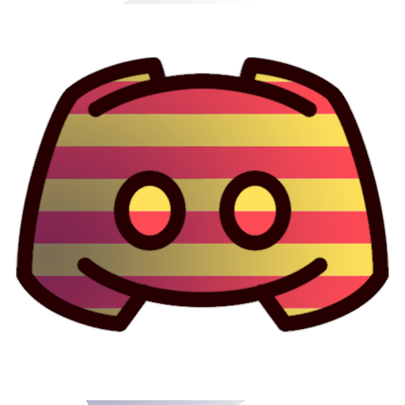

# CataBot

## This is our new BETA Discord Bot called CataBot



## Contribuiting

### To keep it up to date

First install [Node.js](https://nodejs.org/en/) LTS Version if you don't have it installed yet.

Clone it and download dependencies with

```txt
npm install discord.js
npm install opusscript
npm install ytdl-core
npm install simple-youtube-api
npm install canvas
npm install node-fetch
npm install express
npm install moment
npm install @vitalets/google-translate-api
npm install weather-js
npm install chalk
```

If you are running this locally
You also need to install [FFmpeg](https://www.youtube.com/watch?v=qjtmgCb8NcE).

```txt
sudo apt-get install ffmpeg
npm install ffmpeg
```

## **COMMANDS**

You can now visit our page [here](https://catalahd.github.io/CataBot/) and see all the [commands](https://catalahd.github.io/CataBot/commands.html)

## LICENSE

[Rank Icons](https://www.flaticon.com/packs/rank-badge) made by [Dimitry Miroliubov](https://www.flaticon.com/authors/dimitry-miroliubov) from [Flaticon](https://www.flaticon.com/)

Copyright 2020 © All rights reserved

Under MIT License, see [here](LICENSE)

## CURRENT VERSION

1.0
